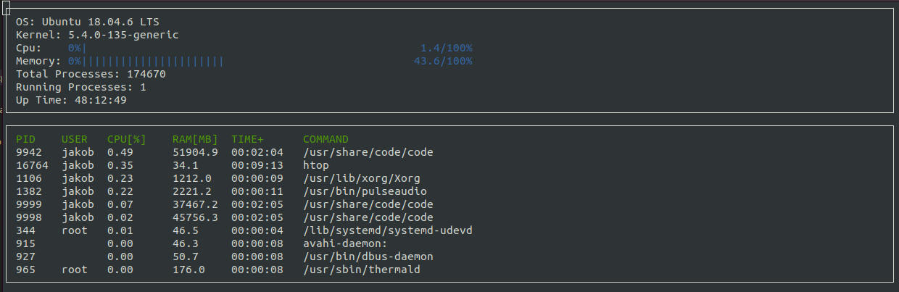
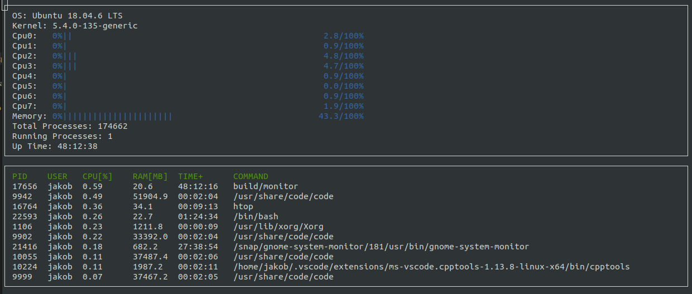

# CppND-System-Monitor Implementation

This is my implementation of the CppMD-Syste-Monitor for the 2. excercise of the cpp-nanodegree. 

# How-to use

1. Build the project: `make build`

2. There are two options to launch the executable: 
  a: normal mode: `./build/monitor`
      <figure>
        
      </figure>
  b: extended information mode: `./build/monitor -i`
      <figure>
        
      </figure>
