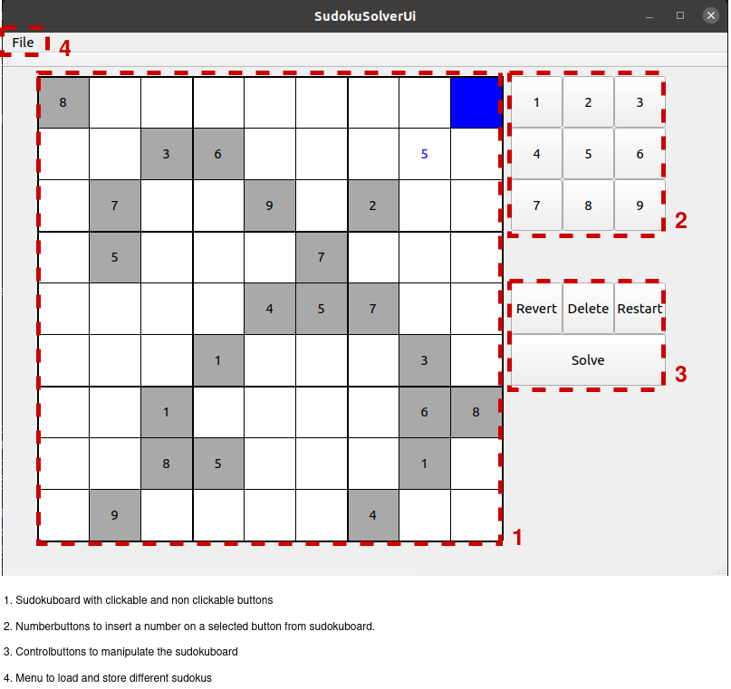
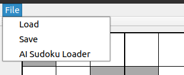
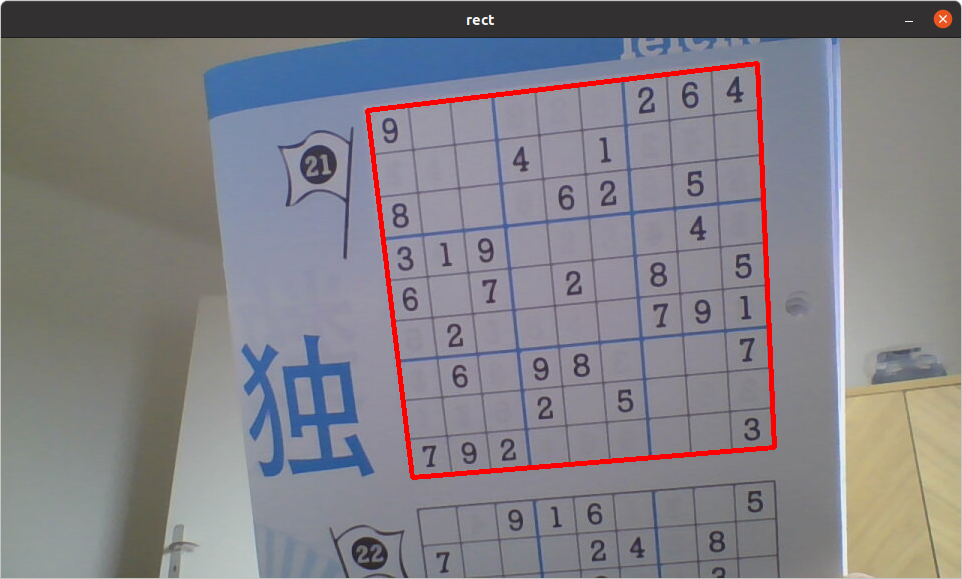

# Sudokugame with AI-Sudokudetector

This repository contains my contribution for the capstone project of the [Udacity C++ Nanodegree Program](https://www.udacity.com/course/c-plus-plus-nanodegree--nd213)

## 1. Dependencies for Running Locally
The code has been tested on Ubuntu 20.04 with the following additional dependencies:
* cmake >= 3.20
* make >= 4.2.1
* gcc/g++ >= 9.4.0
* OpenCV >= 4.5.4 
* Qt >= 5.10

## 2. Basic Build Instructions
1. Clone this repository
2. Create a build directory in the top-level directory: `mkdir build && cd build`
3. Compile the code : `cmake .. && make`
4. Run the application:  `cd ./sudoku_gui && ./SudokuUi`.

## 3. Expected Behavior
The objective of this project is to implement the logic of Sudoku with a user interface created using Qt5. The user can load predefined Sudoku puzzles and solve them interactively through the user interface. Additionally, the user can automatically solve the currently opened Sudoku board. The automatic solving algorithm is based on backtracking ([Sudoku solving algorithm: Backtracking](https://en.wikipedia.org/wiki/Sudoku_solving_algorithms#Backtracking)).

Furthermore, the application allows loading photos of Sudoku puzzles. The implemented image processing detects the Sudoku puzzle automatically and recognizes all digits using a simple self-trained Convolutional Neural Network (CNN). The CNN is pretrained on the [Keras: MNIST](https://keras.io/examples/vision/mnist_convnet/) and finetuned using a customized dataset. The model training is done with Keras and Tensorflow in Python and then integrated into the C++ application using OpenCV for inference.

1. Basic Controls:

    

2. Menu-Options: 
    
    

    - Load a predefined Sudoku 
    - Load a Sudoku from an image
    - Save the current board to file

4. Detected sudoku by AI Sudoku Loader: 

    

## 4. Projectstructure
### The most important files in this repository are:

- 'sudoku_gui/src/main.cpp': Entry point for the executable.
- 'sudoku_gui/src/sudoku_solver_ui.cpp' and 'sudoku_gui/include/sudoku_solver_ui.h': Main logic for the Sudoku solver user interface.
- 'sudoku/sudoku.cpp' and 'sudoku/sudoku.h': Logic for handling Sudoku puzzles.
- 'imageprocessing/imageprocessing.cpp' and 'imageprocessing/imageprocessing.h': Logic for image processing, extracting the Sudoku board, and digit recognition.

### There are also some less interesting helper files, such as:
- sudoku_gui/include/level_handler.h and sudoku_gui/include/level_selector_ui.h: basic ui for loading and storing sudokus. 
- sudoku_gui/include/style.h: styledefinitions for the ui

### Additionally, there are some files that are not relevant to the C++ project itself but included for recreating the entire project:
- training/python: includes all files for training the CNN which is used for number recognition (Not part) 
- training/cpp: Files used for training.
- resources/custom_dataset: Custom prepared dataset for fine-tuning the CNN.
- resources/level: Example Sudokus.
- resources/frozen_mnist_retrained.pb: Trained and frozen CNN used for digit recognition.

## 5. Rubric Points Addressed:
- The project demonstrates an understanding of C++ functions and control structures: i.e. 'imageprocessing/imageprocessing.cpp' and 'sudoku/sudoku.cpp'
- The project reads data from a file and process the data, or the program writes data to a file: 'sudoku/sudoku.cpp' Sudoku::LoadState and Sudoku::SaveState
- The project uses Object Oriented Programming techniques: i.e. 'sudoku/sudoku.h' and 'sudoku/sudoku.cpp'
- Classes use appropriate access specifiers for class members: i.e. 'sudoku/sudoku.h' and 'sudoku/sudoku.cpp'
- Class constructors utilize member initialization lists: i.e. sudoku_gui/src/level_selector_ui.cpp `LevelSelectorUi::LevelSelectorUi`
- The project makes use of references in function declarations: i.e. image_processing/imageprocessing.cpp `std::optional<int> GetBiggestNonBorderContour`

## 6. References
- The image-processing part of this project was inspired by the following source: https://pyimagesearch.com/2020/08/10/opencv-sudoku-solver-and-ocr/
